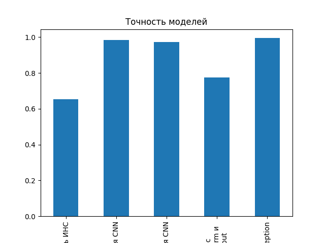
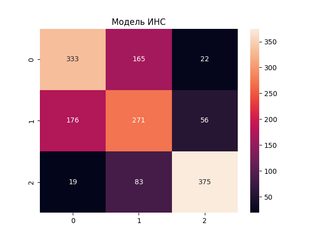
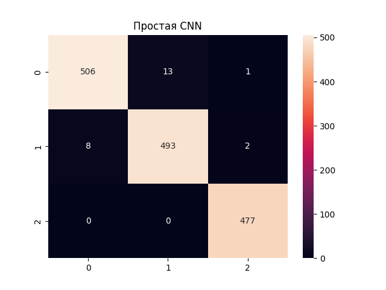
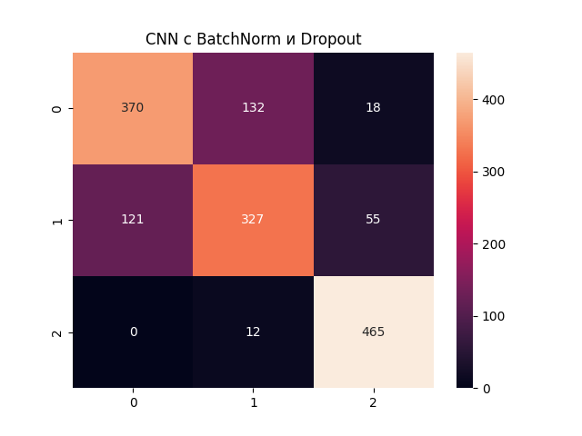
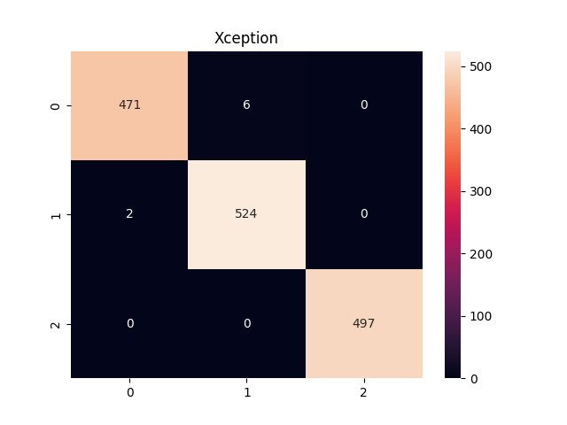

# 🖼️ Классификация изображений (Кот, Собака, Панда)

Этот проект посвящён сравнению пяти моделей глубокого обучения для классификации изображений, выбору лучшей по метрике F1, развертыванию API с использованием FastAPI и созданию интерактивного интерфейса через Streamlit.

---

## 📊 Датасет

Используется кастомный датасет с изображениями, разделёнными на три категории:
- **0 = Кот** 🐱
- **1 = Собака** 🐶
- **2 = Панда** 🐼

Большинство моделей работают с изображениями размером **32x32 пикселя**, за исключением одной модели, требующей **150x150 пикселей**. Эта модель развёрнута по адресу:  
🔗 [Демо](https://imageclass-casha.streamlit.app/)

---

## 🧠 Сравниваемые модели

Ниже приведены пять моделей глубокого обучения, которые были протестированы:

1. **Полносвязная нейронная сеть (ИНС)**  
   - **Вход**: Плоский вектор (32x32x3 = 3072 признаков)  
   - **Архитектура**: 1024 → 512 → 256 → 3 (softmax)

2. **Простая CNN**  
   - **Вход**: 32x32x3  
   - **Архитектура**: Conv2D(32) → MaxPooling → Conv2D(64) → MaxPooling → Flatten → Dense(128) → Dropout(0.5) → Dense(3, softmax)

3. **Глубокая CNN**  
   - **Вход**: 32x32x3  
   - **Архитектура**: Множество слоёв Conv2D и MaxPooling → Dense(256) → Dropout(0.5) → Dense(3, softmax)

4. **CNN с BatchNorm и Dropout**  
   - **Вход**: 32x32x3  
   - **Архитектура**: Conv2D → BatchNormalization → MaxPooling → Dropout → Dense(1024 → 512 → 256 → 128 → 3, softmax)

5. **Трансферное обучение с Xception**  
   - **Вход**: 150x150x3  
   - **Архитектура**: Предобученная модель Xception → Dense(128 → 64 → 32 → 3, softmax)

---

## 📈 Результаты сравнения

Таблица ниже суммирует производительность моделей:

| Модель                     | Точность | Полнота | Точность (Precision) | F1-Score | Время вывода |
|----------------------------|----------|---------|----------------------|----------|--------------|
| ИНС                        | 0.65     | 0.65    | 0.65                 | 0.65     | 0.63 с       |
| Простая CNN                | 0.98     | 0.97    | 0.98                 | 0.96     | 0.61 с       |
| Глубокая CNN               | 0.97     | 0.96    | 0.96                 | 0.97     | 2.20 с       |
| CNN с BatchNorm            | 0.78     | 0.77    | 0.78                 | 0.78     | 4.62 с       |
| Xception (Трансфер)        | **0.99** | **0.99** | **0.98**            | **0.98** | 142.92 с     |

> **Примечание**: Модель Xception показала лучший F1-score, но имеет значительно большее время вывода.

---

## 📊 Визуализации

### **Гистограммы метрик**
<div style="display: flex; flex-direction: row; gap: 20px;">
  
  
</div>

### **Матрицы ошибок**
<div style="display: flex; flex-direction: row; gap: 10px; flex-wrap: wrap;">
  
  
  
  
  
</div>

---

## 🚀 Установка и запуск

Для локального запуска проекта выполните следующие шаги:

1. **Клонируйте репозиторий** или скачайте архив:
   ```bash
   git clone https://github.com/caashka/image_class.git
   cd master

2. **Создайте и активируйте виртуальное окружение:**

   **На Windows:**

   ```bash
   python -m venv .venv
   .venv\Scripts\activate
   ```

   **На macOS/Linux:**

   ```bash
   python3 -m venv .venv
   source .venv/bin/activate
   ```

3. **Убедитесь, что у вас установлены Python 3.x и pip. Установите зависимости:**

   ```bash
   pip install -r requirements.txt
   ```

4. **В одном терминале запустите сервер FastAPI** (при необходимости замените порт):

   ```bash
   uvicorn main:app --host 0.0.0.0 --port 8000
   ```

5. **В другом терминале запустите приложение Streamlit:**

   ```bash
   streamlit run app.py
   ```

6. **Перейдите по адресу** [http://localhost:8501](http://localhost:8501) (если не меняли порт по умолчанию) и протестируйте работу приложения:

   - Выберите режим **«Загрузить изображение»** и укажите файл, либо
   - Выберите режим **«Нарисовать изображение»** и создайте свой рисунок для классификации.

## 🌐Развертывание

- **Streamlit-приложение** -развернуто на Streamlit Cloud: [🔗ссылка](https://imageclass-casha.streamlit.app/)
- **API** - развернуто на Render.com: [🔗ссылка](https://image-class-9vgx.onrender.com)

## 🛠️Использование API
Отправьте POST-запрос на /predict с файлом изображения.
С помощью curl:
  ```curl
curl -X POST -F "file=@path/to/image.jpg" https://image-class-9vgx.onrender.com/predict
```

С помощью Python:
```python
import requests
response = requests.post("https://image-class-9vgx.onrender.com/predict", files={"file": open("path/to/image.jpg", "rb")})
print(response.json())
```

Пример ответа:
```json
{
    "predicted_class": 1,
    "probabilities": [0.1, 0.8, 0.1]
}
```


